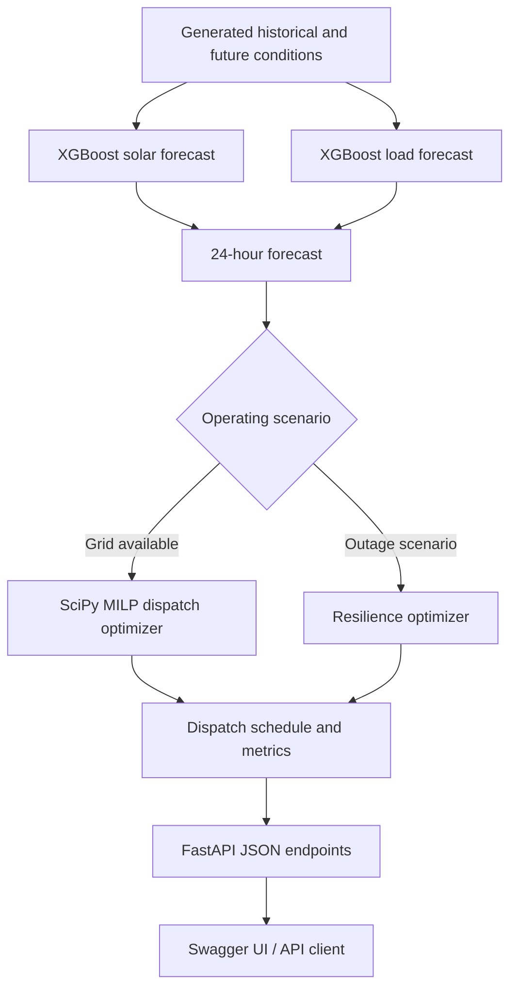

# VoltForge

**AI-Driven Microgrid Optimization & Resilience API**

VoltForge is a Python/FastAPI software prototype that connects machine-learning forecasts to constrained energy-dispatch optimization. It forecasts solar generation and electrical demand, calculates a 24-hour dispatch schedule, models battery operating limits, and exposes simulation endpoints for grid outages and changing operating conditions.

The goal is to demonstrate an end-to-end decision pipeline: **forecast → optimize → inspect dispatch → test resilience**.

> **Prototype scope:** VoltForge currently uses generated synthetic data and simulated operating scenarios. It is not connected to a physical microgrid, battery-management system, utility grid, or live telemetry, and it has not been validated for real-world power-system operation.

## What it does

- **Solar and load forecasting:** Trains separate XGBoost regression models for expected solar generation and electrical load.
- **24-hour planning:** Produces forecasts and dispatch schedules for a 24-hour horizon.
- **Constrained dispatch optimization:** Uses SciPy mixed-integer linear programming (MILP) to model grid import, battery charging/discharging, state of charge (SOC), solar curtailment, and a binary battery operating mode.
- **Battery constraints:** Models configured capacity, SOC bounds, charging/discharging power limits, efficiency, and a terminal SOC reserve.
- **Resilience scenarios:** Includes grid blackout/island-mode behavior, grid restoration, cloud-cover disturbance, and load-spike simulation.
- **Critical-load prioritization:** The resilience model separates forecast demand into configurable critical and non-critical portions and penalizes unserved critical demand more heavily.
- **REST API and interactive docs:** Uses FastAPI to expose current state, forecasts, dispatch, metrics, resilience information, and simulation controls.

## Architecture



### Forecasting

The current implementation generates **90 days of hourly synthetic historical data** with a fixed random seed. Simulated inputs include hour of day, day of week, weekend indicator, cloud cover, and temperature. Two `XGBRegressor` models estimate solar generation and load.

The code reserves the final 24 records of the generated dataset for an internal MAE calculation. This is a small synthetic-data validation setup, **not** evidence of forecast accuracy on real metered data. The service trains the models during application startup and returns the current forecast metrics through the API.

### Dispatch optimization

The normal dispatch model uses `scipy.optimize.milp` with linear constraints. Its modeled decisions include:

- Grid electricity import
- Battery charge and discharge power
- Battery state of charge
- Solar curtailment
- A binary battery operating mode to prevent simultaneous charging and discharging

The objective accounts for the configured time-dependent grid tariff and a small battery-cycling penalty. Constraints include power balance, SOC dynamics and bounds, charge/discharge limits, and a minimum terminal SOC requirement. This is a model of a simulated microgrid, not a command interface for electrical hardware.

### Resilience optimization

The separate resilience model represents part of the predicted demand as critical load and the remainder as non-critical load. It assigns a larger penalty to unserved critical demand, includes battery and energy-balance constraints, and models a configurable blackout interval. In the current API, the blackout interval passed to the resilience optimizer is **hours 18–21 inclusive** of the forecast horizon.

The critical/non-critical split and the simulated outage window are prototype assumptions. They should be replaced with site-specific, validated requirements before any real operational use.

## Technology stack

| Component | Technology | Role |
|---|---|---|
| Language | Python | Application and optimization logic |
| API | FastAPI | HTTP endpoints and interactive API documentation |
| Forecasting | XGBoost, scikit-learn | Solar/load regression models and MAE calculation |
| Optimization | SciPy MILP | Constrained hourly dispatch and resilience schedules |
| Data handling | pandas, NumPy | Time-series tables, model inputs, and schedule calculations |
| API output | JSON | State, forecasts, schedules, and metrics |

## Repository structure

```text
VoltForge/
├── README.md
├── .gitignore
└── backend/
    ├── main.py
    ├── forecaster.py
    ├── optimizer.py
    ├── resilience.py
    ├── battery.py
    ├── simulator.py
    ├── requirements.txt
    ├── optimizer_schedule.csv
    └── resilience_schedule.csv
```

- `main.py` — FastAPI application, system state, forecast/dispatch routes, metrics, and scenario controls.
- `forecaster.py` — synthetic historical data generation, XGBoost training, and 24-hour forecasts.
- `optimizer.py` — normal-mode MILP dispatch optimization.
- `resilience.py` — resilience-oriented dispatch, critical/non-critical load handling, and resilience scoring.
- `battery.py` — standalone battery simulation logic.
- `simulator.py` — standalone microgrid data simulation.
- `optimizer_schedule.csv` and `resilience_schedule.csv` — schedule data artifacts included in the repository.

## Getting started

### Requirements

- Python 3
- `pip`
- A terminal on macOS, Linux, or Windows (PowerShell virtual-environment activation differs from the macOS/Linux example below)

### 1. Clone the repository

```bash
git clone https://github.com/AnonymousCoderOp/VoltForge.git
cd VoltForge
```

The first command downloads the repository to your computer. The second moves the terminal into the project folder.

### 2. Create and activate a virtual environment

Run these commands from the repository root:

```bash
cd backend
python3 -m venv .venv
source .venv/bin/activate
```

- `cd backend` moves into the directory containing the FastAPI application.
- `python3 -m venv .venv` creates an isolated Python environment inside `backend/.venv`.
- `source .venv/bin/activate` activates that environment for the current terminal session on macOS/Linux.

### 3. Install dependencies

```bash
python -m pip install --upgrade pip
python -m pip install -r requirements.txt
```

The first command updates `pip` within the active environment. The second installs the backend dependencies declared in `backend/requirements.txt`, so you do not have to install each package manually.

### 4. Start the API

```bash
uvicorn main:app --reload
```

Run this command from the **backend** directory with the virtual environment active. Uvicorn starts the API locally; `--reload` restarts the development server when code changes.

On startup, VoltForge generates synthetic history and trains the forecasting models. The training/validation MAE values are printed in the terminal.

Open the interactive API documentation:

**http://127.0.0.1:8000/docs**

Stop the local server with `Ctrl+C`.

## API reference

The current application exposes the following routes:

| Method | Endpoint | Purpose |
|---|---|---|
| GET | `/` | Basic service information |
| GET | `/health` | API status, operating mode, and model/optimizer labels |
| GET | `/state` | Current in-memory state and forecast metrics |
| GET | `/forecast` | 24-hour solar/load forecast and evaluation metrics |
| GET | `/dispatch` | Dispatch schedule for the current operating state |
| GET | `/metrics` | Current operating snapshot, grid-energy/cost metrics, and forecast accuracy or resilience information |
| GET | `/resilience` | Resilience score and resilience schedule |
| POST | `/simulate/cloud` | Activates the simulated cloud-cover disturbance |
| POST | `/simulate/load-spike` | Activates the simulated load increase |
| POST | `/simulate/blackout` | Marks the grid unavailable and switches system state to island mode |
| POST | `/simulate/restore` | Restores grid availability and clears the cloud/load-spike flags |

### Try the API

With the server running, open another terminal window.

**Check service health**

```bash
curl http://127.0.0.1:8000/health
```

This sends a GET request to the health endpoint and prints its JSON response.

**Inspect the 24-hour forecast**

```bash
curl http://127.0.0.1:8000/forecast
```

This returns the generated forecast, the horizon, model label, and current forecast metrics.

**Inspect the dispatch schedule**

```bash
curl http://127.0.0.1:8000/dispatch
```

This asks the API for a dispatch schedule using the current in-memory system state.

**Simulate cloud cover, then inspect the forecast**

```bash
curl -X POST http://127.0.0.1:8000/simulate/cloud
curl http://127.0.0.1:8000/forecast
```

The POST request activates the simulated cloud-cover override; the GET request returns the forecast generated under that override.

**Simulate a load spike**

```bash
curl -X POST http://127.0.0.1:8000/simulate/load-spike
curl http://127.0.0.1:8000/forecast
```

The load-spike scenario increases the predicted load used by the current forecast pipeline.

**Simulate a blackout and restore the grid**

```bash
curl -X POST http://127.0.0.1:8000/simulate/blackout
curl http://127.0.0.1:8000/dispatch
curl -X POST http://127.0.0.1:8000/simulate/restore
```

These calls mark the grid unavailable, inspect the resulting dispatch response, and then restore the grid. In the current implementation, restoration also clears the cloud-cover and load-spike flags. All these requests affect the running process in-memory; they do not control real grid equipment.

## Current assumptions and limitations

- **Synthetic data:** Historical inputs and future conditions are generated by the code; there is no connection to live weather, smart-meter, or inverter data.
- **Prototype evaluation:** MAE values are computed against a small held-out section of synthetic data. They should not be presented as real-world accuracy benchmarks.
- **Simulated economics:** Tariffs and dispatch costs are model outputs based on the configured tariff schedule, not verified electricity-bill savings.
- **In-memory state:** Scenario flags are stored in application memory and are reset when the process restarts; there is no database or multi-user state isolation.
- **Development CORS setting:** The current API allows all origins. This should be restricted before any public or production deployment.
- **No hardware control or safety certification:** The API is for software simulation and evaluation, not direct battery, inverter, protective-relay, or utility-grid control.
- **No production deployment claim:** Real-world use would require measured data, independent model validation, power-system engineering review, security hardening, fault handling, and hardware-in-the-loop testing.

## Roadmap

- Pin and lock dependency versions after testing a known-good environment for more reproducible installs.
- Evaluate forecasts on documented real or benchmark datasets with time-aware validation.
- Add baseline comparisons for dispatch cost and feasibility under identical scenarios.
- Expand scenario testing and report critical-load served/unserved energy transparently.
- Add visualization for forecasts, dispatch decisions, battery SOC, and resilience outcomes.
- Harden API configuration and state management before deployment.
- Explore validated integrations with real-time telemetry and hardware only after appropriate safety review.

## Author

**Anubhava Srivastava**

Repository: [github.com/AnonymousCoderOp/VoltForge](https://github.com/AnonymousCoderOp/VoltForge)

---

*VoltForge is an engineering prototype for exploring how forecasting, constrained optimization, and scenario-based resilience assessment can work together in a simulated microgrid.*
